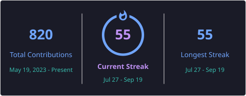

<h1 align="center">Mohanad Yehia</h1>

  <b>Software QA Engineer</b> · Test automation across web, mobile and API 
  Cairo, Egypt · UTC+2

  <a href="https://linkedin.com/in/mohanad49">LinkedIn</a> ·
  <a href="https://myehia.vercel.app">Portfolio</a> ·
  <a href="https://testpulse-eight.vercel.app">Live QA dashboard</a> ·
  <a href="mailto:mohanned.3262@gmail.com">Email</a>

---

I test a multi-tenant club-management platform at **Blue Ribbon** — a Flutter app and an
admin portal covering payments, bookings, subscriptions and access control. I joined
doing manual testing on a production launch, then built the automation that replaced most
of it: **2,500+ test cases, 500+ defects, and 85% of the regression suite now running on
one command in CI**, across Playwright (web), Maestro (mobile) and pytest (API).

The repositories below are the same discipline applied in public. Every one of them runs
on a schedule, and the badges are live — including one that is red on purpose, and one
repo that has no badge at all because a real product gate in it is failing.

## Featured work

### 🎯 A full QA engagement

**[caldiy-qa-strategy](https://github.com/Mohanad49/caldiy-qa-strategy)** — six phases
against a real scheduling platform: risk-led strategy, a Dockerised pinned instance,
API contract tests, Playwright lifecycle coverage, a 14-test timezone/DST suite, BDD,
axe and visual gates, k6 performance gates with a capacity-one contention proof, tiered
CI, and two defect reports filed upstream.

The result I'd want read first is the one that isn't green: **accessibility passes 1 of 3
surfaces**, and that stays visible. It's a finding about the product, not a flaky test to
retry away — which is also why there is no CI badge on that repo while a real product gate
is failing. **[Allure report →](https://mohanad49.github.io/caldiy-qa-strategy/)**

### 🛠 Tools I built

| | |
|---|---|
| **[TestPulse](https://github.com/Mohanad49/testpulse)** — test observability and flake detection  | A CI suite has no memory, so "this test is flaky" and "you broke this on Tuesday" look identical. TestPulse ingests results over time and tells them apart with two flake strategies whose tradeoffs are argued, not assumed. Five of my repositories report into it nightly. Python · FastAPI · React · Postgres — **[live dashboard →](https://testpulse-eight.vercel.app)** |
| **[llm-eval-harness](https://github.com/Mohanad49/llm-eval-harness)** — evaluating non-deterministic systems   | `assertEqual` does not work on a system that answers differently each time. This measures pass *rates* with confidence intervals, validates its own LLM judge against human labels (κ 0.51 — so it gates on nothing), and red-teams the subject. **The red badge is the result:** the security gate fails because the suite found real data leaks. A gate that cannot fail anything is decoration. — **[report →](https://mohanad49.github.io/llm-eval-harness/)** |

### 🧪 Automation frameworks

| Repository | What it demonstrates | Stack |
|---|---|---|
| **[orangehrm-playwright](https://github.com/Mohanad49/orangehrm-playwright)**  | E2E across HR modules. The app under test runs in Docker after the public demo turned out to accept writes with `200` and discard them — which took the suite from 2/18 to 18/18 | Playwright · TypeScript |
| **[open-source-webapp-qa-portfolio](https://github.com/Mohanad49/open-source-webapp-qa-portfolio)**  | 70 checks over auth, forms, waits, tables, alerts and uploads — the Selenium predecessor to the Playwright work above | Selenium · pytest |
| **[github-api-tests](https://github.com/Mohanad49/github-api-tests)**  | REST coverage with JSON Schema validation, negative cases, and a client that paces itself against GitHub's secondary rate limits | Python · requests · pytest |
| **[api-testing-framework-ci](https://github.com/Mohanad49/api-testing-framework-ci)**  | Full CRUD lifecycle with auth, data-driven payloads and a published evidence hub | Postman · Newman |
| **[wikipedia-maestro](https://github.com/Mohanad49/wikipedia-maestro)** | Mobile flows on a real Android app, on an emulator, in CI | Maestro · Android |
| **[jmeter_performance_testing_report](https://github.com/Mohanad49/jmeter_performance_testing_report)** | Load testing a prediction API and reporting latency against explicit acceptance criteria | JMeter · Python |

## What I work with

|  |  |
|---|---|
| **Automation** | Playwright · Selenium · pytest · Maestro · Appium · Postman/Newman |
| **API & performance** | REST · JSON Schema · JMeter · Allure |
| **Languages** | Python · TypeScript · JavaScript · Java · SQL |
| **Infrastructure** | GitHub Actions · Docker · PostgreSQL · FastAPI |
| **Practice** | Test strategy · risk-based prioritisation · defect reporting · flake triage · CI/CD |

## Background

B.Sc. Computer Science & Engineering, **German University in Cairo** (2026). Graduation
project: car price prediction over a 3M-record dataset, best R² 0.947. Junior TA for
CSEN202 across 100+ students.

Arabic (native) · English (C1) · German (A2)

  

